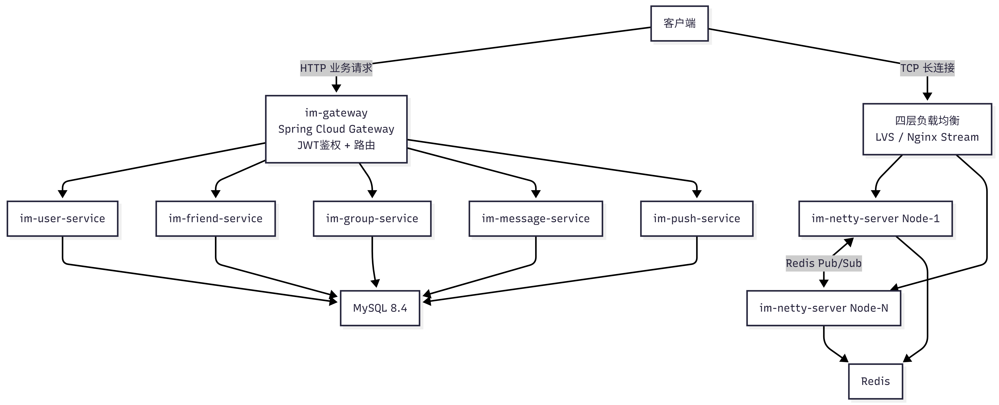

# IM-Server 分布式即时通讯系统

面向千万级在线用户的分布式IM平台

## 项目简介

基于微服务架构的高性能即时通讯系统，支持单聊、群聊、好友管理、离线推送等核心能力。

**当前阶段**：基础架构搭建完成，核心通讯链路已打通，正在向千万级生产能力迭代演进。

**已实现能力**：
- ✅ TCP长连接通讯，Protobuf 二进制协议编解码
- ✅ 用户注册登录、JWT + Redis 登录鉴权体系
- ✅ 好友关系管理（添加/删除/申请/黑名单）
- ✅ 群组管理（建群/成员管理/禁言/公告）
- ✅ 单聊消息收发 + Redis Pub/Sub 集群消息路由
- ✅ 消息持久化、会话管理、已读位置追踪、消息撤回
- ✅ 心跳保活机制 + 空闲连接自动断开
- ✅ 定时任务调度（消息清理、离线补发、设备清理）
- ✅ 多厂商推送适配（极光/个推/华为/小米/APNs）

**规划中能力**：
- 🔲 RocketMQ 消息异步投递与削峰填谷
- 🔲 消息 ACK 确认机制（送达回执/已读回执）
- 🔲 群聊消息完整分发逻辑（写扩散/读扩散）
- 🔲 多设备登录支持（手机+PC+Web 同时在线）
- 🔲 Sentinel 多层限流熔断
- 🔲 MySQL 分库分表（ShardingSphere）
- 🔲 会话消息 Sequence 序号体系

## 技术栈

| 分类 | 组件 | 版本 |
|------|------|------|
| 运行环境 | OpenJDK | 21 |
| 核心框架 | Spring Boot | 3.5.15 |
| 微服务框架 | Spring Cloud | 2025.0.0 |
| 微服务全家桶 | Spring Cloud Alibaba | 2025.0.0.0 |
| API网关 | Spring Cloud Gateway | 配套版本 |
| 注册/配置中心 | Nacos | 2.x |
| 长连接通讯 | Netty | 4.x |
| 序列化协议 | Protobuf | 4.28.2 |
| ORM框架 | MyBatis-Plus | 3.5.10.1 |
| 缓存 | Redis | 7.x |
| 数据库 | MySQL | 8.4 LTS |
| 定时任务 | XXL-JOB | 适配版本 |
| 安全加固 | BouncyCastle | 1.84（修复LDAP注入） |
| 安全加固 | commons-lang3 | 3.18.0（修复CVE-2025-48924） |

## 微服务模块划分

    im (父工程)
    ├── im-common           # 公共模块：JWT工具、鉴权拦截器、统一响应、全局异常处理、Redis/MyBatis配置
    ├── im-gateway          # API网关：全局鉴权过滤器、白名单放行、请求头注入X-User-Id
    ├── im-user-service     # 用户服务：注册/登录/用户信息管理、Token颁发与校验
    ├── im-friend-service   # 好友服务：好友关系维护、申请/同意/删除、黑名单管理
    ├── im-group-service    # 群组服务：群组CRUD、成员角色管理、禁言、群公告
    ├── im-message-service  # 消息服务：消息发送/拉取/撤回、会话管理、未读数维护
    ├── im-push-service     # 推送服务：策略模式多厂商适配、推送任务与记录
    ├── im-task-service     # 定时任务：历史消息清理、离线消息补发、设备数据归档（XXL-JOB + 分布式锁）
    └── im-netty-server     # 长连接服务：Netty TCP服务器、Protobuf编解码、心跳、集群消息路由

### 服务间调用关系（Feign）

    im-friend-service  ──→  im-user-service      # 查询好友用户信息
    im-task-service    ──→  im-message-service    # 触发历史消息清理、离线消息补发
    im-task-service    ──→  im-push-service       # 触发推送数据归档
    im-task-service    ──→  im-user-service       # 查询用户状态
    im-task-service    ──→  设备清理（内部逻辑）    # 清理过期设备绑定
    im-netty-server    ──→  im-user-service       # 登录时校验Token（备用链路）

## 流量分层模型

    ┌─────────────────────────────────────────────────────┐
    │                      客户端                          │
    └──────────┬──────────────────────────┬───────────────┘
               │ HTTP业务请求              │ TCP长连接
               ▼                          ▼
    ┌──────────────────┐      ┌─────────────────────────┐
    │   im-gateway     │      │     四层负载均衡          │
    │  (Spring Cloud   │      │    (LVS/Nginx Stream)   │
    │   Gateway)       │      └────────────┬────────────┘
    │  JWT鉴权+路由     │                   │
    └────────┬─────────┘                   ▼
             │                ┌─────────────────────────┐
             ▼                │    im-netty-server 集群   │
    ┌────────────────────┐    │  ┌─────────┐ ┌─────────┐ │
    │ 业务微服务集群       │    │  │ Node-1  │ │ Node-N  │ │
    │ user/friend/group/ │    │  │ (Netty) │ │ (Netty) │ │
    │ message/push       │    │  └────┬────┘ └────┬────┘ │
    └────────┬───────────┘    │       │  Redis Pub/Sub   │
             │                │       └───────┬─────────┘ │
             ▼                └───────────────┼───────────┘
    ┌──────────────────┐                     │
    │  MySQL / Redis   │◄────────────────────┘
    │  (数据持久化层)    │    消息持久化 + 路由查询
    └──────────────────┘

> TCP长连接流量不经过 Gateway，避免海量连接造成网关性能瓶颈

## 通讯协议规范

TCP报文帧格式：

    ┌──────────┬──────────┬──────────────┬───────────────────┐
    │ 魔数(2B) │ 版本(1B) │ 消息体长度(4B)│ Protobuf消息体(变长) │
    │ 0x1234   │  0x01    │  body length │   ImPacket        │
    └──────────┴──────────┴──────────────┴───────────────────┘

- **魔数 2字节**：`0x1234`，标识合法数据包
- **版本 1字节**：协议版本号，当前 `0x01`
- **消息体长度 4字节**：Protobuf 序列化后的字节数，配合 `LengthFieldBasedFrameDecoder` 解决 TCP 粘包/拆包
- **消息体**：Protobuf 二进制编码的 `ImPacket`

核心指令定义（Protobuf `MsgType` 枚举）：

| 指令码 | 名称 | 说明 |
|--------|------|------|
| 1 | LOGIN_REQUEST | 长连接登录鉴权（携带JWT Token） |
| 2 | LOGIN_RESPONSE | 登录鉴权响应 |
| 3 | HEARTBEAT_REQUEST | 客户端心跳保活 |
| 4 | HEARTBEAT_RESPONSE | 服务端心跳响应 |
| 5 | PRIVATE_MESSAGE | 单聊消息 |
| 6 | GROUP_MESSAGE | 群聊消息 |
| 7 | LOGOUT_REQUEST | 登出断开连接 |

## 消息流转流程

    客户端发送消息（Protobuf ImPacket）
        │
        ▼
    Netty 接收 → 解码器校验魔数/版本 → Protobuf 反序列化
        │
        ▼
    ImMessageHandler 鉴权校验（未登录强制断开）
        │
        ├── 本地在线 → 直接通过 Channel 转发给目标用户
        │
        └── 本地不在线 → Redis Pub/Sub 发布到集群 Topic
                             │
                             ▼
                        其他 Node 订阅接收 → 判断目标是否在本节点
                             │
                             ├── 在线 → 转发到目标 Channel
                             └── 不在线 → 丢弃（规划中：触发离线推送）

    并行流程（HTTP接口）：
    客户端 → Gateway → im-message-service → MySQL 持久化
                                           → 刷新会话表 + 未读数 +1

## 数据库设计

共 14 张表，按业务域划分：

| 业务域 | 表名 | 说明 |
|--------|------|------|
| 用户 | `sys_user` | 用户账号信息 |
| 好友 | `im_friend_relation` | 好友关系（双向存储） |
| 好友 | `im_friend_apply` | 好友申请（状态流转） |
| 好友 | `im_friend_blacklist` | 黑名单 |
| 群组 | `im_group` | 群组主表 |
| 群组 | `im_group_member` | 群成员（含角色/禁言） |
| 群组 | `im_group_notice` | 群公告 |
| 消息 | `im_message` | 消息主表（雪花ID，全局时序递增） |
| 消息 | `im_conversation` | 用户会话列表（冗余未读数+最后消息） |
| 消息 | `im_conversation_read` | 会话已读位置追踪 |
| 推送 | `im_user_device` | 用户设备绑定 + 推送令牌 |
| 推送 | `im_push_task` | 推送任务（单推/批量/全员） |
| 推送 | `im_push_record` | 推送记录（幂等+回溯） |
| 任务 | `im_task_log` | 定时任务执行日志 |

## API 接口清单

### 用户服务（im-user-service）

| 方法 | 路径 | 说明 |
|------|------|------|
| POST | `/user/register` | 用户注册 |
| POST | `/user/login` | 用户登录，返回JWT Token |
| GET | `/user/info` | 获取当前登录用户信息 |
| PUT | `/user/info` | 修改个人信息（昵称/头像/手机/邮箱） |
| PUT | `/user/password` | 修改密码 |
| GET | `/user/list` | 用户分页列表（后台管理） |
| PUT | `/user/status/{userId}` | 启用/禁用账号 |
| GET | `/user/{id}` | 根据ID查询用户 |

### 好友服务（im-friend-service）

| 方法 | 路径 | 说明 |
|------|------|------|
| GET | `/friend/list` | 查询好友列表（含用户信息装配） |
| GET | `/friend/ids` | 获取好友ID集合 |
| DELETE | `/friend/remove` | 删除好友 |
| PUT | `/friend/remark` | 修改好友备注 |
| POST | `/friend/apply/submit` | 发起好友申请 |
| PUT | `/friend/apply/handle` | 处理好友申请（同意/拒绝） |
| GET | `/friend/apply/list/pending` | 分页查询待处理申请 |
| POST | `/friend/blacklist/add` | 拉黑用户（自动解除双向好友关系） |
| DELETE | `/friend/blacklist/remove` | 移出黑名单 |
| GET | `/friend/blacklist/ids` | 查询黑名单ID列表 |

### 群组服务（im-group-service）

| 方法 | 路径 | 说明 |
|------|------|------|
| POST | `/group/create` | 创建群组 |
| POST | `/group/allMute` | 全群禁言开关 |
| POST | `/group/dissolve` | 解散群组 |
| GET | `/group/info` | 查询群组信息 |
| POST | `/group/member/mute` | 单人禁言（支持设置到期时间） |
| POST | `/group/member/setAdmin` | 设置/取消管理员 |
| POST | `/group/member/remove` | 移除群成员 |
| POST | `/group/notice/publish` | 发布群公告 |
| DELETE | `/group/notice/delete` | 删除群公告 |
| GET | `/group/notice/list` | 查询群公告列表 |

### 消息服务（im-message-service）

| 方法 | 路径 | 说明 |
|------|------|------|
| POST | `/message/send` | 发送消息（落库+刷新会话+未读数+1） |
| POST | `/message/pull` | 拉取会话历史消息（游标分页） |
| POST | `/message/recall` | 撤回消息（仅发送方可撤回） |
| GET | `/conversation/list` | 拉取用户会话列表 |
| POST | `/conversation/markRead` | 标记会话已读 |

### 推送服务（im-push-service）

| 方法 | 路径 | 说明 |
|------|------|------|
| POST | `/push/single` | 单用户推送 |
| POST | `/push/batch` | 批量推送 |
| POST | `/push/all` | 全员推送 |
| POST | `/device/bind` | 绑定设备（存储推送令牌） |
| POST | `/device/unbind` | 解绑设备 |

## 推送适配器架构

采用**策略模式**，统一 `PushChannel` 接口，各厂商独立实现：

    PushChannel（策略接口）
    ├── JPushChannelImpl       # 极光推送
    ├── HuaweiPushChannelImpl  # 华为推送
    ├── XiaomiPushChannelImpl  # 小米推送
    └── ApnsPushChannelImpl    # 苹果 APNs

通过 `PushChannelFactory` 根据设备绑定的 `push_channel` 类型自动路由到对应适配器，新增厂商只需实现接口并注册即可。

## 定时任务清单

基于 XXL-JOB 调度 + Redis 分布式锁（`TaskLockHelper`），保证集群内单实例执行：

| 任务 | 说明 |
|------|------|
| `messageCleanJob` | 清理超过保留天数的历史消息（游标分批删除，避免锁表） |
| `offlineMsgResendJob` | 扫描近24小时未读消息，触发离线推送补发 |
| `deviceCleanJob` | 清理长期未上线的过期设备绑定记录 |
| `pushDataArchiveJob` | 推送数据定期归档，减轻在线表压力 |

## 鉴权链路设计

    客户端请求 → Gateway AuthGlobalFilter
        │
        ├── 白名单接口（/user/login, /user/register）→ 注入 X-Is-White: true → 放行
        │
        └── 需认证接口 → 提取 token → Redis 校验 auth:token:{token}
             │
             ├── 无效 → 返回 401
             │
             └── 有效 → JWT 解析 userId → 注入 X-User-Id 请求头 → 转发下游
                                            │
                                            ▼
                                  业务服务 AuthInterceptor
                                            │
                                            ├── X-Is-White: true → 放行
                                            ├── X-User-Id 存在 → 注入 UserContext → 放行
                                            └── 无 X-User-Id → 403 拒绝（防内网直连绕过）

## 本地开发环境

**虚拟机配置**：
- 系统：Rocky Linux 10.2 Minimal ISO
- 虚拟化：VMware Workstation 17
- 硬件：4核CPU / 8G内存 / 40G SATA SSD / 桥接模式静态IP
- 预装：Nacos、MySQL 8.4、Redis 7、XXL-JOB

> VMware 安装 Rocky Linux 10 关键配置：新建虚拟机系统选择 `RHEL9 64位`，固件设置为 BIOS，磁盘类型选择 SATA

## 服务启动顺序

1. 启动中间件：Nacos → MySQL → Redis → XXL-JOB
2. 启动公共模块：`mvn install` 编译 im-common
3. 启动网关服务：im-gateway（端口 10000）
4. 启动业务服务：im-user-service → im-friend-service → im-group-service
5. 启动核心服务：im-netty-server（TCP 9000 / HTTP 8085）→ im-message-service → im-push-service
6. 启动定时任务：im-task-service

## 开发迭代规划

| 阶段 | 内容 | 状态 |
|------|------|------|
| Phase 1 | 基础工程搭建、Nacos集成、Gateway网关、登录鉴权体系 | ✅ 已完成 |
| Phase 2 | Netty长连接服务、Protobuf编解码、心跳保活、集群路由 | ✅ 已完成 |
| Phase 3 | 好友管理、群组管理、单聊/群聊消息收发、会话管理 | ✅ 已完成 |
| Phase 4 | 推送服务、多厂商适配、定时任务调度 | ✅ 已完成 |
| Phase 5 | 接入 RocketMQ，消息异步投递、离线消息可靠补发 | 🔲 进行中 |
| Phase 6 | 消息 ACK 机制、多设备登录、群聊分发优化 | 🔲 待开发 |
| Phase 7 | Sentinel 限流熔断、Netty 集群会话路由改造 | 🔲 待开发 |
| Phase 8 | MySQL 分库分表、消息 Sequence 体系、性能压测 | 🔲 待开发 |

## 常见踩坑记录

1. **VMware 报错 `Unable to find the VMX binary`**
   解决方案：创建虚拟机选择 RHEL9 64位，固件切换为 BIOS 模式

2. **Rocky Linux 安装界面识别不到硬盘**
   解决方案：磁盘类型选择 SATA，禁止使用 NVMe 磁盘

3. **Nacos 服务发现找不到**
   解决方案：所有服务的 `spring.cloud.nacos.discovery.namespace` 和 `config.namespace` 必须保持一致

4. **Netty 开发注意事项**
    - TCP通道建立后，首条消息强制为鉴权包，未鉴权连接发送业务消息直接断开
    - 必须添加 `LengthFieldBasedFrameDecoder` 处理 TCP 粘包拆包
    - `@ChannelHandler.Sharable` 标注的 Handler 必须是线程安全的，不能持有连接私有状态

5. **安全漏洞修复记录**
    - `commons-lang3` 强制升级到 3.18.0，修复 CVE-2025-48924（ClassUtils 递归漏洞）
    - `BouncyCastle` 全系锁定 1.84，修复 LDAP 注入漏洞

## License

MIT
